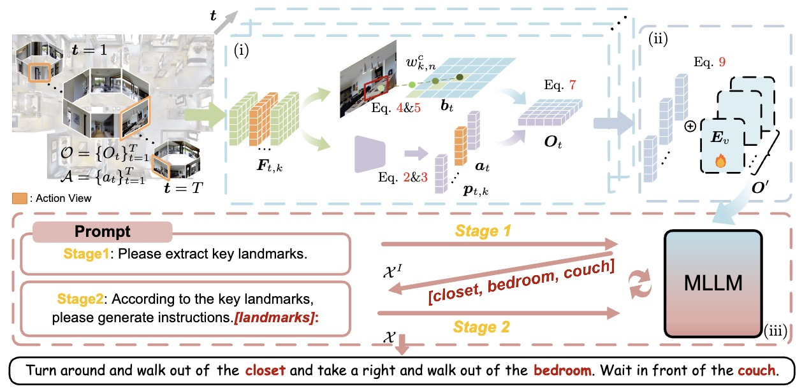

# Navigation Instruction Generation with BEV Perception and Large Language Models
Contributed by Sheng Fan, Rui Liu, Wenguan Wang, and Yi Yang.



## Installation
Install the dependencies.
```
pip install -r requirements.txt
```

## Training
After the preparation, you can start training with the following commands.
```
bash  exps/finetune.sh  $LLAMA_PATH \
                        $LLAMA_ADAPTER_PATH  \ 
                        config/data/pretrain_r2r.json \
                        results/r2r_bevinstructor
```


## Inference
```
CUDA_VISIBLE_DEVICES='0' python demo_r2r_lmp.py --ckpt_dir results/r2r_bevinstructor
```

## Citation

If you find BEVInstructor useful or inspiring, please consider citing our paper:

```bibtex
@inproceedings{fan2024bevinstructor,
      title={Navigation Instruction Generation with BEV Perception and Large Language Models}, 
      author={Fan, Sheng and Liu, Rui and Wang, Wenguan and Yang, Yi},
      booktitle={ECCV},
    year={2024}
}
```

## Contact
This repository is currently maintained by [Sheng Fan](mailto:shengfancs@zju.edu.cn).